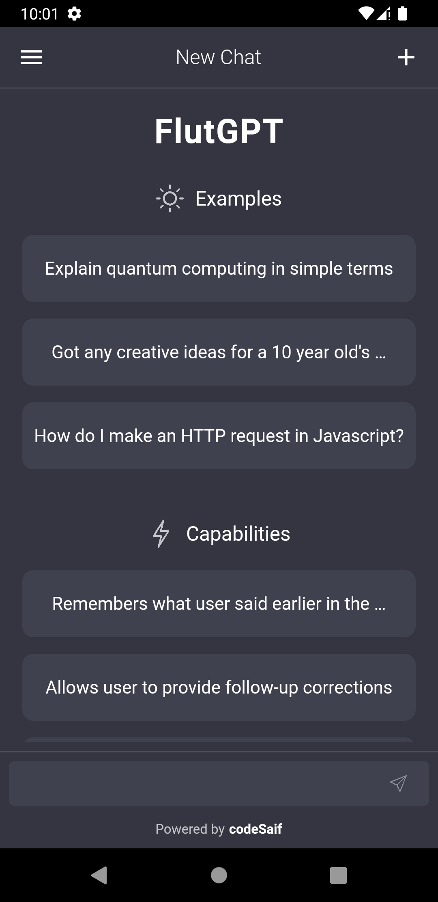
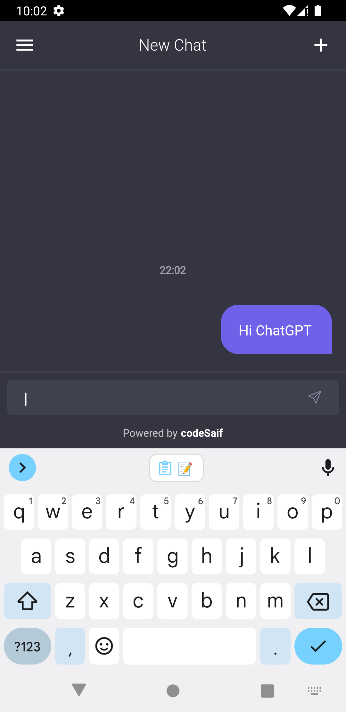

# FlutGPT

This repository contains the source code for a ChatGPT Android app built using Flutter. The app utilizes OpenAI's GPT-3 language model to generate text based on user inputs. The Flutter framework allows for fast and beautiful UI development, making the app an enjoyable experience for users. Explore the code to learn more about integrating language models with Flutter and building AI-powered apps.

## 📸 ScreenShots

| Home                             | Chat                              |
| --------------------------------- | --------------------------------- |
|   |   |

## 💻 Requirements

- Any Operating System (ie. MacOS X, Linux, Windows)
- Any IDE with Flutter SDK installed (ie. IntelliJ, Android Studio, VSCode etc)
- A little knowledge of Dart and Flutter

## 📝 Features

- [ ] Dark Mode
- [ ] Multiple Chats

## 🤓 Author(s)

**[Saifudeen Hisham](https://www.instagram.com/beSaif)**

## 🔖 LICENCE

[GNU General Public License v3.0](/LICENSE.md)
